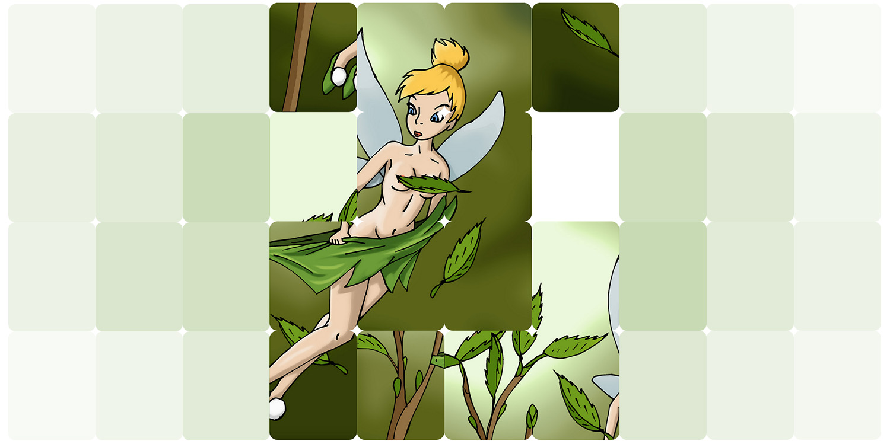

# Simple 15 puzzle game for HTML 

A simple implementation of the classic mini-game Fifteen Sliding Puzzle, using HTML DOM document elements and without using Canvas or third party libraries. 

To use it, you need to create a div element with ID "fifteen" and add an array with parameters, the script will do the rest itself. The script is very simple and you can easily add this mini-game to your web page.


# Structure

```html
<html>
    <head>
    </head>
    <body>
        <div id='fifteen'></div> <!--element "fifteen" in which the game will take place-->
        <script>
        var setup={
             puzzle_fifteen:{
                diff:16, // difficulty, how many squares will be shuffled
                size:[512,640], // element size "fifteen" in pixels only
                grid:[3,3], // the number of squares in the height and width of the picture
                art:{
                    url:"art.jpg", // path to the picture (you can use any format of supported browsers, gif-animation of svg)
                    ratio:false // enlarge the picture in height or width
                },
                // optional elements
                time:"0.1s", // block move animation time
                style:"border-radius:12px;" // style for puzzle square
             }
        }
        </script>
        <script src="fifteen_puzzle.js"></script> <!--path to file engine-->
    </body>
</html>
```

[](https://ko-fi.com/E1E54DM6V)

[](https://www.patreon.com/kirill_live)
